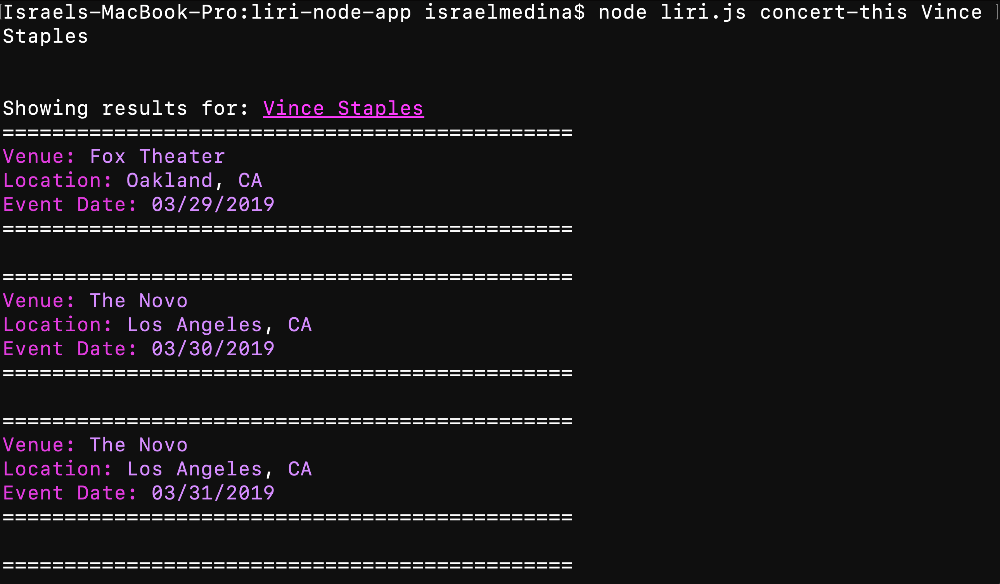

# liri-node-app
This application is similar to Siri but instead is a language interpretation and recognition interface.

The liri node app is a CLI based app meaning that it takes inputs through the terminal and can generate results based on what it is given. We've stored the response in a variable.

```javascript
//variable set to what the user wants to do 
//is followed after liri.js
var response = process.argv[2];
```

The user has a set of options: 

* concert-this
* spotify-this-song
* movie-this
* do-what-it-says

Each option takes one input and displays information for the item entered. 

```javascript
//evaluate the response given by the user
if (response === "concert-this") {
    concert_this(process.argv.slice(3).join(" "));

}
if (response === "spotify-this-song") {
    spotify_this_song(process.argv.slice(3).join(" "));

}
if (response === "movie-this") {
    movie_this(process.argv.slice(3).join(" "));

}
if (response === "do-what-it-says") {
    do_what_it_says();

}
```

## concert-this
"concert-this" is a function that takes in an artist enterd and displays any upcoming shows using axios and the "bands-in-town" api.

```javascript
//concert this function to look up concerts
function concert_this(artist) {
    //url to give to our axios
    queryUrl = "https://rest.bandsintown.com/artists/" + artist + "/events?app_id=codingbootcamp";
    //call axios to retrieve info
    axios.get(queryUrl).then(function (response) {
        //start of our information being displayed
        console.log("\n\nShowing results for: " + chalk.hex('#ff19f7').underline(artist));
        //set results to response and then the data array that is included in our response
        var results = response.data;
        //for loop to display our data
        for (var i = 0; i < results.length; i++) {
            var concerts = results[i];
            //show the data
            console.log("==============================================")
            console.log(chalk.magenta("Venue: ") + chalk.blueBright(concerts.venue.name));
            console.log(chalk.magenta("Location: ") + chalk.blueBright(concerts.venue.city) + ", " + chalk.blueBright(concerts.venue.region));
            console.log(chalk.magenta("Event Date: ") + chalk.blueBright(moment(concerts.datetime).format("MM/DD/YYYY")));
            console.log("==============================================\n")
        };
    }).catch(function (err) {
        //log error if caught
        console.log(err);
    });
};
```

The code is ran, showing us the information in a colorful pallete using the ```chalk()``` npm install and illustrates 
* Venue Name
* Location
* Event Date


## spotify-this-song
## movie-this
## do-what-it-says
