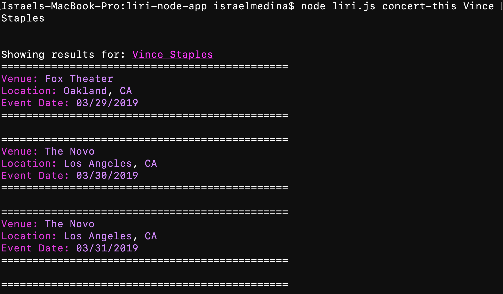
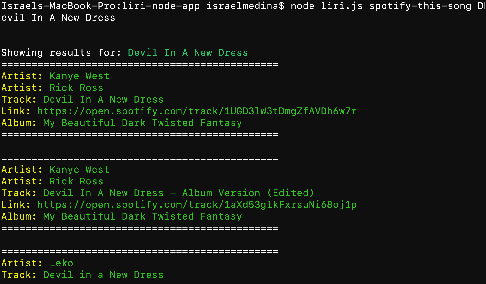
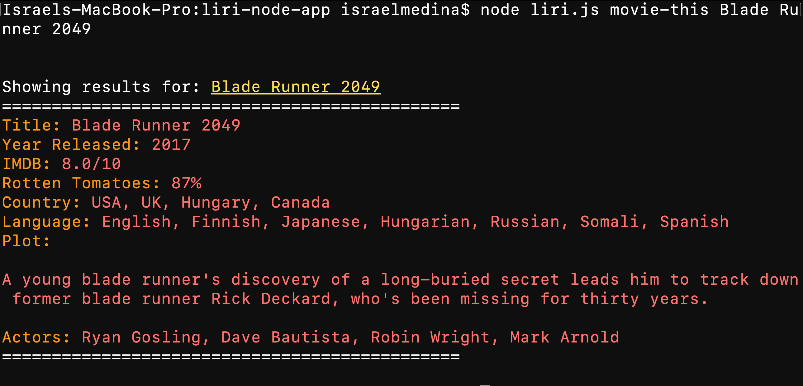
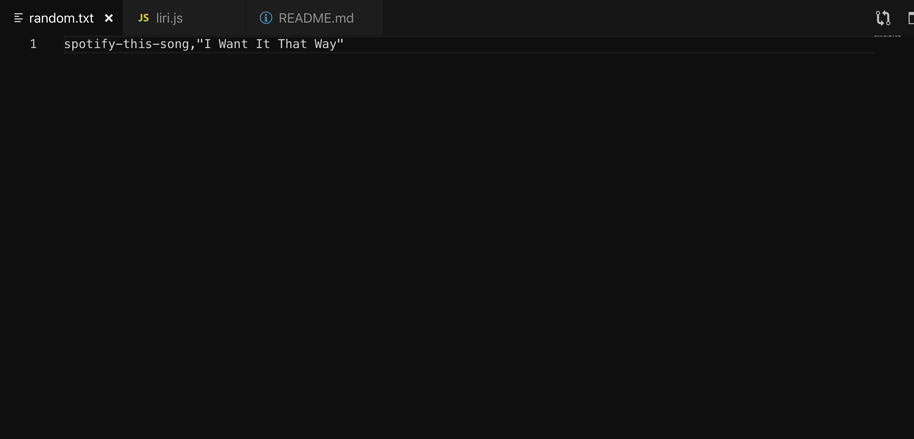
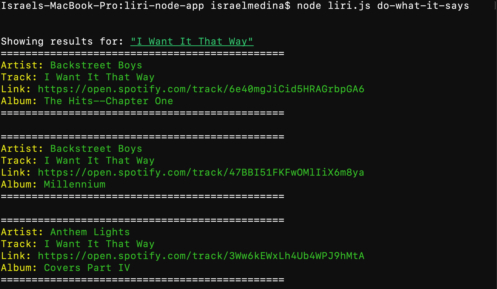

# liri-node-app
This application is similar to Siri but instead is a language interpretation and recognition interface.

The liri node app is a CLI based app meaning that it takes inputs through the terminal and can generate results based on what it is given. The response is stored in a variable.

```javascript
//variable set to what the user wants to do 
//is followed after liri.js
var response = process.argv[2];
```

The user has a set of options: 

* concert-this
* spotify-this-song
* movie-this
* do-what-it-says

Each option takes one input and displays information for the item entered. 

```javascript
//evaluate the response given by the user
if (response === "concert-this") {
    concert_this(process.argv.slice(3).join(" "));

}
if (response === "spotify-this-song") {
    spotify_this_song(process.argv.slice(3).join(" "));

}
if (response === "movie-this") {
    movie_this(process.argv.slice(3).join(" "));

}
if (response === "do-what-it-says") {
    do_what_it_says();

}
```

## concert-this
```concert-this()``` is a function that takes in an artist enterd and displays any upcoming shows using ```axios``` and the "bands-in-town" API. I've also included ```moment.js``` to format the date, making it easier to read.

```javascript
//concert this function to look up concerts
function concert_this(artist) {
    //url to give to our axios
    queryUrl = "https://rest.bandsintown.com/artists/" + artist + "/events?app_id=######";
    //call axios to retrieve info
    axios.get(queryUrl).then(function (response) {
        //start of our information being displayed
        console.log("\n\nShowing results for: " + chalk.hex('#ff19f7').underline(artist));
        //set results to response and then the data array that is included in our response
        var results = response.data;
        //for loop to display our data
        for (var i = 0; i < results.length; i++) {
            var concerts = results[i];
            //show the data
            console.log("==============================================")
            console.log(chalk.magenta("Venue: ") + chalk.blueBright(concerts.venue.name));
            console.log(chalk.magenta("Location: ") + chalk.blueBright(concerts.venue.city) + ", " + chalk.blueBright(concerts.venue.region));
            console.log(chalk.magenta("Event Date: ") + chalk.blueBright(moment(concerts.datetime).format("MM/DD/YYYY")));
            console.log("==============================================\n")
        };
    }).catch(function (err) {
        //log error if caught
        console.log(err);
    });
};
```

The code is ran, showing us the information in a colorful pallete using the ```chalk()``` npm install and illustrates: 
* Venue Name
* Location
* Event Date


## spotify-this-song
```spotify_this_song()``` is next on our list and works with the Spotify API to show the user information about a song, including:
* The artists featured on the song
* The track name
* A link to the song on spotify
* Name of the album it appears on

```javascript
//spotify this to search matching songs on spotify
function spotify_this_song(song){
    spotify.search({type: "track", query: song})
    .then(function(response) {
        //start of info
        console.log("\n\nShowing results for: " + chalk.hex('#059322').underline(song));
        var results = response.tracks.items
        //for loop to display the info given back from spotify
        for (var i = 0; i < results.length; i++) {
            var track = results[i];
            console.log("==============================================")
            //to generate a list of artists
            for (var j = 0; j < track.artists.length; j++) {
                console.log(chalk.yellowBright("Artist: ") + chalk.green(track.artists[j].name));
            }
            //song name
            console.log(chalk.yellowBright("Track: ") + chalk.green(track.name));
            //spotify link 
            console.log(chalk.yellowBright("Link: ") + chalk.green(track.external_urls.spotify)); 
            //album name
            console.log(chalk.yellowBright("Album: ") + chalk.green(track.album.name));
            console.log("==============================================\n")
        }
    }).catch(function(err){
        console.log(err);
    })

};
```
Color is added here as well and the user can search any song that is on Spotify's databse.



## movie-this
```movie-this()``` is my favorite, and uses ```axios``` again to retrieve information about any given movie. This will tell the user:
* Title of the movie
* Year it was released
* IMDB rating
* Rotten Tomatoes score
* Country it was made in
* Language its played in
* Plot of the movie
* Major actors of the movie

```javascript
//movie this function to look up info on a given movie
function movie_this(movie){
    //axios to retrieve info about the movie
    axios.get("http://www.omdbapi.com/?t=" + movie + "&y=&plot=short&apikey=********").then
    (function(response) {
        //start of the info
        console.log("\n\nShowing results for: " + chalk.hex('#ffde26').underline(movie));
        var search = response.data;
        //everything that is needed
        console.log("==============================================")
        console.log(chalk.hex('#ff6302')("Title: ") + chalk.hex('##f23f3c')(search.Title));
        console.log(chalk.hex('#ff6302')("Year Released: ") + chalk.hex('##f23f3c')(search.Year));
        console.log(chalk.hex('#ff6302')("IMDB: ") + chalk.hex('##f23f3c')(search.Ratings[0].Value));
        console.log(chalk.hex('#ff6302')("Rotten Tomatoes: ") + chalk.hex('##f23f3c')(search.Ratings[1].Value));
        console.log(chalk.hex('#ff6302')("Country: ") + chalk.hex('##f23f3c')(search.Country));
        console.log(chalk.hex('#ff6302')("Language: ") + chalk.hex('##f23f3c')(search.Language));
        console.log(chalk.hex('#ff6302')("Plot: \n\n") + chalk.hex('##f23f3c')(search.Plot + "\n"));
        console.log(chalk.hex('#ff6302')("Actors: ") + chalk.hex('##f23f3c')(search.Actors));
        console.log("==============================================\n")
    })
    .catch(function(err) {
        console.log(err);
    });

}
```

As you may notice, the user can input single and multiple worded entries on the command line for all search functions.


## do-what-it-says

Lastly, ```do-what-it-says()``` is very literal and will do the function written in the ```random.txt``` file. 

```javascript
//do what it says function to read what is in our random.txt and perform its instructions
function do_what_it_says(){
    //fs.readfile to read the file we give it
    fs.readFile("random.txt", "utf8", function(err, data){
        if (err) {
            return console.log(err);
        }
        //split the text in the file by any commas
        var output = data.split(",");
        toDo = output[0];
        search = output[1];
        //if the first part of the data array is x, do y 
        if (toDo === "concert-this") {
            concert_this(search);
        
        }
        if (toDo === "spotify-this-song") {
            spotify_this_song(search);
        
        }
        if (toDo === "movie-this") {
            movie_this(search);
        
        }

    })

}
```
You can place any of the other functions shown above, along with a search entry, and it will run.



